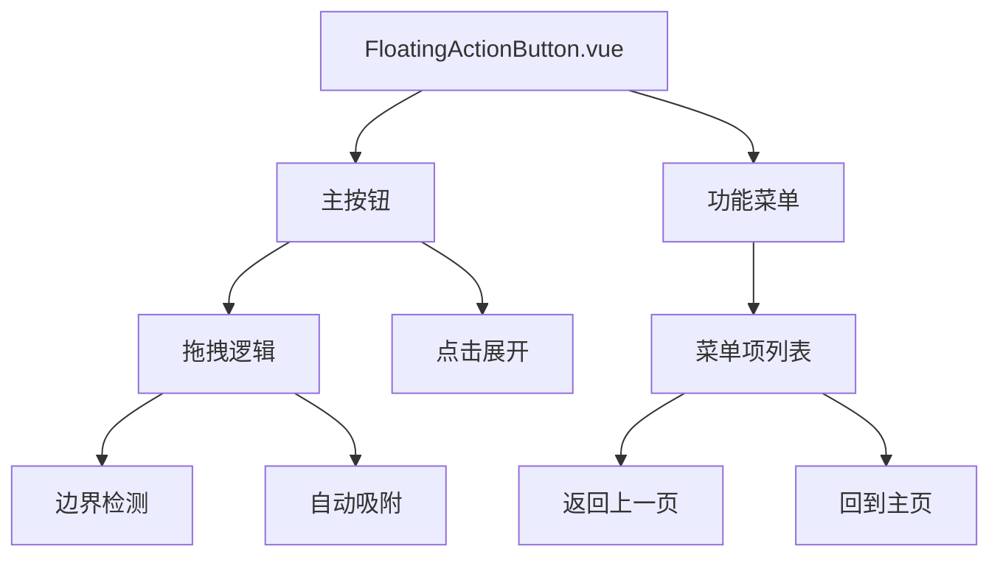

# 悬浮功能按钮（FloatingActionButton）教学文档

## 📋 项目概述

本文档详细介绍了如何在 Vue 3 + TypeScript + Vite 项目中实现一个类似 iOS AssistiveTouch 的悬浮功能按钮组件。该组件具有拖拽、展开菜单、边界吸附等特性，并在全局范围内可见。

## 🎯 功能特性

### 核心功能
- ✅ **可拖拽移动**：支持鼠标和触摸事件，可在屏幕内自由拖拽
- ✅ **边界自动吸附**：拖拽结束后自动吸附到屏幕左右边缘
- ✅ **点击展开菜单**：点击主按钮展开/收起功能菜单
- ✅ **流畅动画效果**：丰富的 CSS 动画和过渡效果
- ✅ **响应式设计**：适配不同屏幕尺寸
- ✅ **全局可见**：在所有页面中都能看到和使用

### 当前功能列表
1. **返回上一页**：调用 `router.back()` 返回上一个访问的页面
2. **回到主页**：导航到网站首页

## 🏗️ 设计思路与架构

### 1. 组件架构设计



### 2. 核心技术选型

| 技术 | 用途 | 优势 |
|------|------|------|
| Vue 3 Composition API | 组件逻辑管理 | 更好的类型推导，逻辑复用 |
| TypeScript | 类型安全 | 提供完整的类型检查 |
| CSS3 Transforms | 位置控制和动画 | 硬件加速，性能优越 |
| Vue Router | 页面导航 | 与 Vue 生态完美集成 |

### 3. 状态管理设计

```typescript
// 核心响应式状态
const isExpanded = ref(false)      // 菜单展开状态
const isDragging = ref(false)      // 拖拽状态
const position = reactive({ x: 20, y: 100 })        // 按钮位置
const dragOffset = reactive({ x: 0, y: 0 })         // 拖拽偏移量
const dragStartPos = reactive({ x: 0, y: 0 })       // 拖拽起始位置
```

## 🔧 实现细节详解

### 1. 拖拽功能实现

#### 1.1 事件处理策略
我们采用了统一的事件处理函数来同时支持鼠标和触摸事件：

```typescript
// 拖拽开始 - 统一处理鼠标和触摸事件
const startDrag = (event: MouseEvent | TouchEvent) => {
  event.preventDefault()
  isDragging.value = true
  
  // 兼容鼠标和触摸事件的坐标获取
  const clientX = 'touches' in event ? event.touches[0].clientX : event.clientX
  const clientY = 'touches' in event ? event.touches[0].clientY : event.clientY
  
  // 记录起始位置偏移
  dragStartPos.x = clientX - position.x
  dragStartPos.y = clientY - position.y
  
  // 添加全局事件监听，确保在元素外也能响应
  document.addEventListener('mousemove', onDrag)
  document.addEventListener('mouseup', stopDrag)
  document.addEventListener('touchmove', onDrag, { passive: false })
  document.addEventListener('touchend', stopDrag)
}
```

#### 1.2 拖拽位置计算
使用 CSS `transform` 属性进行位置更新，避免重排重绘：

```typescript
// 拖拽过程中的位置计算
const onDrag = (event: MouseEvent | TouchEvent) => {
  if (!isDragging.value) return
  
  const clientX = 'touches' in event ? event.touches[0].clientX : event.clientX
  const clientY = 'touches' in event ? event.touches[0].clientY : event.clientY
  
  // 计算偏移量，而不是直接修改最终位置
  dragOffset.x = clientX - dragStartPos.x - position.x
  dragOffset.y = clientY - dragStartPos.y - position.y
}
```

#### 1.3 边界检测与自动吸附
停止拖拽时进行边界检测和自动吸附：

```typescript
const stopDrag = () => {
  // 计算新位置
  const newX = position.x + dragOffset.x
  const newY = position.y + dragOffset.y
  
  const windowWidth = window.innerWidth
  const windowHeight = window.innerHeight
  const buttonSize = 56
  
  // 水平方向：自动吸附到最近的边缘
  position.x = newX < windowWidth / 2 ? 20 : windowWidth - buttonSize - 20
  
  // 垂直方向：限制在可视区域内
  position.y = Math.max(20, Math.min(newY, windowHeight - buttonSize - 20))
  
  // 重置状态
  dragOffset.x = 0
  dragOffset.y = 0
  isDragging.value = false
}
```

### 2. 菜单展开动画实现

#### 2.1 CSS 动画策略
使用 `transform` 和 `opacity` 实现流畅的展开动画：

```css
.fab-menu-item {
  /* 初始状态：缩小、下移、透明 */
  transform: translateY(20px) scale(0.8);
  opacity: 0;
  transition: all 0.3s cubic-bezier(0.25, 0.8, 0.25, 1);
}

.floating-action-button.expanded .fab-menu-item {
  /* 展开状态：正常大小、位置、不透明 */
  transform: translateY(0) scale(1);
  opacity: 1;
}
```

#### 2.2 错位动画效果
通过 CSS 自定义属性实现菜单项的错位动画：

```typescript
// 在模板中为每个菜单项设置延迟
:style="{ 
  '--index': index,
  transitionDelay: isExpanded ? `${index * 50}ms` : `${(menuItems.length - index - 1) * 50}ms`
}"
```

### 3. 响应式设计实现

#### 3.1 媒体查询适配
```css
@media (max-width: 768px) {
  .fab-main-button {
    width: 50px;
    height: 50px;
  }
  
  .fab-menu-item {
    min-width: 120px;
  }
}
```

#### 3.2 视觉效果优化
- **渐变背景**：使用线性渐变创建现代感
- **毛玻璃效果**：`backdrop-filter: blur(10px)` 实现背景模糊
- **阴影层次**：多层阴影营造立体感
- **悬停反馈**：鼠标悬停时的缩放和阴影变化

## 📁 文件结构

```
src/
├── components/
│   └── FloatingActionButton.vue    # 悬浮按钮组件
├── App.vue                         # 全局集成
└── router/
    └── index.ts                    # 路由配置
```

## 🔌 集成方式

### 1. 创建组件文件
在 `src/components/` 目录下创建 `FloatingActionButton.vue`

### 2. 在 App.vue 中全局引入
```vue
<script setup lang="ts">
import FloatingActionButton from './components/FloatingActionButton.vue'
</script>

<template>
  <router-view />
  <FloatingActionButton />
</template>
```

这样确保了组件在所有页面中都可见。

## 🎨 样式设计理念

### 1. 现代扁平化设计
- 使用渐变色彩搭配
- 圆角和阴影营造层次感
- 适度的透明度和模糊效果

### 2. 交互反馈
- 悬停时的微妙缩放效果
- 点击时的下压反馈
- 流畅的过渡动画

### 3. 可访问性考虑
- 足够的点击区域（44px+）
- 良好的色彩对比度
- 支持键盘操作

## 🚀 功能扩展指南

### 1. 添加新的菜单项

在 `menuItems` 数组中添加新项：

```typescript
const menuItems = ref([
  // ... 现有项目
  {
    id: 'settings',
    label: '设置',
    icon: SettingsIcon,  // 需要自定义图标组件
    action: 'settings'
  }
])
```

在 `handleMenuClick` 函数中添加对应的处理逻辑：

```typescript
const handleMenuClick = (item: any) => {
  switch (item.action) {
    // ... 现有 case
    case 'settings':
      // 处理设置逻辑
      break
  }
}
```

### 2. 自定义图标组件

创建新的 SVG 图标组件：

```typescript
const SettingsIcon = {
  template: `
    <svg width="20" height="20" viewBox="0 0 24 24" fill="none">
      <!-- SVG 路径 -->
    </svg>
  `
}
```

### 3. 主题定制

通过 CSS 自定义属性支持主题切换：

```css
.floating-action-button {
  --primary-color: #667eea;
  --secondary-color: #764ba2;
  --text-color: #333;
  --bg-color: rgba(255, 255, 255, 0.95);
}
```

### 4. 位置记忆功能

可以添加 localStorage 来记住用户的自定义位置：

```typescript
// 保存位置
const savePosition = () => {
  localStorage.setItem('fab-position', JSON.stringify(position))
}

// 加载位置
const loadPosition = () => {
  const saved = localStorage.getItem('fab-position')
  if (saved) {
    Object.assign(position, JSON.parse(saved))
  }
}
```

## 🔍 性能优化

### 1. 事件监听优化
- 使用事件委托减少内存占用
- 及时移除事件监听器避免内存泄漏
- 合理使用 `passive` 选项优化滚动性能

### 2. 动画性能
- 使用 `transform` 和 `opacity` 替代 `left/top`
- 利用 CSS3 硬件加速
- 避免强制同步布局

### 3. 响应式数据优化
- 使用 `reactive` 管理位置对象
- 合理使用 `ref` 和 `reactive`
- 避免不必要的响应式包装

## 🧪 测试要点

### 1. 功能测试
- [x] 拖拽功能在不同设备上的表现
- [x] 边界检测和自动吸附
- [x] 菜单展开/收起动画
- [x] 路由导航功能
- [x] 响应式布局适配

### 2. 兼容性测试
- [x] 现代浏览器支持
- [x] 移动端触摸事件
- [x] 不同屏幕尺寸适配

### 3. 性能测试
- [x] 拖拽时的流畅度
- [x] 动画性能
- [x] 内存使用情况

## 💡 最佳实践总结

### 1. 代码组织
- **单一职责**：每个函数只处理一个特定功能
- **类型安全**：充分利用 TypeScript 的类型系统
- **可维护性**：清晰的命名和注释

### 2. 用户体验
- **即时反馈**：所有交互都有视觉反馈
- **直观操作**：符合用户习惯的交互模式
- **错误预防**：边界检测避免按钮跑出屏幕

### 3. 可扩展性
- **配置化设计**：菜单项通过配置数组管理
- **组件化思维**：独立的图标组件便于复用
- **主题支持**：预留样式定制空间

## 🎓 学习要点

通过这个项目，您可以学到：

1. **Vue 3 Composition API** 的实际应用
2. **TypeScript** 在 Vue 项目中的类型定义
3. **CSS3 动画** 和 **Transform** 的高级用法
4. **事件处理** 的最佳实践
5. **响应式设计** 的实现方法
6. **组件设计** 的思维模式

这个悬浮功能按钮组件展示了现代前端开发的多个重要概念，是一个很好的学习案例。您可以基于这个组件继续扩展更多功能，比如添加更多的快捷操作、支持手势识别、实现主题切换等。

---

**开发完成时间**：2025年8月26日  
**技术栈**：Vue 3 + TypeScript + Vite  
**作者说明**：这是一个功能完整、设计精美的悬浮功能按钮组件，具有良好的扩展性和可维护性。